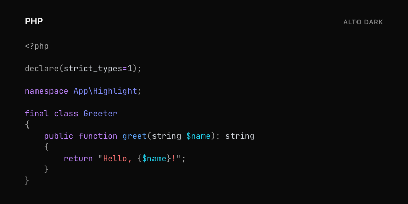

# ALTO \ Code Highlight

Server-side syntax highlighting for PHP applications, with semantic scopes,
embedded languages, and no third-party PHP package dependencies at runtime.

[](https://github.com/altophp/code-highlight/actions/workflows/CI.yml)
[](https://www.php.net/)
[](LICENSE)



Core highlighting runs entirely in PHP. It needs no browser runtime, Node.js
process, or external service. Its parsers assign semantic scopes, so themes can
distinguish a function definition from a call or a type definition from a
reference.

## Install

```bash
composer require alto/code-highlight
```

Requirements:

- PHP 8.4 or later;
- `ext-mbstring`;
- `ext-tokenizer`.

See the [installation guide](docs/installation.md) for verification and
troubleshooting.

## Quick start

```php
<?php

use Alto\Code\Highlight\Highlighter;
use Alto\Code\Highlight\Theme\AltoTheme;

$theme = new AltoTheme();
$highlighter = new Highlighter($theme);
$code = '<?php echo "Hello, Alto!";';

echo '<style>'.$theme->getStylesheet().'</style>';
echo $highlighter->highlight($code, 'php');
```

`highlight()` returns escaped HTML inside
`<pre class="alto-highlight"><code>…</code></pre>`. Emit a theme stylesheet
once per page, then reuse the highlighter for every code block.

## What it covers

- **27 languages:** the PHP web stack plus common programming, markup, data,
  configuration, and query languages.
- **Semantic highlighting:** context-aware scopes for definitions, calls,
  types, variables, constants, and other language concepts.
- **Embedded languages:** CSS and JavaScript in HTML/SVG, fenced code in
  Markdown, and language blocks in Twig.
- **Line controls:** optional line numbers and selected-line emphasis.
- **12 built-in variants:** seven theme families, including Alto, GitHub,
  Dracula, Polar, Cupertino, Noctis, and Solar.
- **Theme compatibility:** adapters for Highlight.js CSS, Prism CSS, and
  TextMate `.tmTheme` files.

## Documentation

| Guide | Contents |
|---|---|
| [Documentation index](docs/index.md) | Choose the right guide |
| [Getting started](docs/getting-started.md) | Complete rendering, line numbers, and errors |
| [Languages](docs/languages.md) | Exact identifiers and language capabilities |
| [Themes](docs/themes.md) | Built-in variants and visual examples |
| [Create a theme](docs/creating-a-theme.md) | Implement `ThemeInterface` |
| [Embedded languages](docs/embedded-languages.md) | HTML, SVG, Markdown, and Twig |
| [Theme adapters](docs/theme-adapters.md) | Highlight.js, Prism, and TextMate |
| [Public API](docs/public-api.md) | Supported entry points and extension contracts |
| [Examples](docs/examples.md) | Compact examples and generated previews |

The complete source examples are available in [`examples/languages/`](examples/languages/).

## Languages

Use the lowercase identifier in the second argument to `highlight()`:

```text
bash        csharp       css          diff         dockerfile
dotenv      go           html         http         ini
java        javascript   json         makefile     markdown
php         python       ruby         rust         scss
sql         svg          swift        twig         typescript
xml         yaml
```

The special `php-snippet` identifier accepts PHP without an opening `<?php`
tag. The [language reference](docs/languages.md) documents exact behavior and
embedded-language support.

## Line numbers and highlighted lines

```php
$html = $highlighter->highlight(
    code: $code,
    language: 'php',
    lineNumbers: true,
    highlightLines: [2, 3],
);
```

## Choose a theme

```php
use Alto\Code\Highlight\Theme\GitHubTheme;

$light = new GitHubTheme(dark: false);
$dark = new GitHubTheme();
```

Browse the [built-in theme matrix](docs/themes.md), learn how to
[create a theme](docs/creating-a-theme.md), or reuse an existing stylesheet
through a [theme adapter](docs/theme-adapters.md).

## Integrations

[alto/twig-code-highlight](https://github.com/altophp/twig-code-highlight)
adds blocks and filters for Twig applications. The core package remains
framework-independent and can be used in Symfony controllers, Laravel views,
static generators, or any PHP rendering pipeline.

## Contributing

Issues and pull requests are welcome. Before proposing a change, run:

```bash
composer qa
```

Language parsers use fixtures under `tests/Language/`. Public showcase examples
live separately under `examples/languages/`; they are short documentation
samples rather than exhaustive parser tests.

## License

ALTO Code Highlight is released under the [MIT License](LICENSE).
