# Examples

The repository contains one curated, compact source example for each of the 27
default languages. The same stable inputs drive documentation previews and
parser checks.

Browse the complete source catalog in
[`examples/languages/`](../examples/languages/), or use the individual links in
the [language reference](languages.md).

## Featured preview matrix

Each image is generated at 800 × 400 pixels from the real public highlighter
API.

### PHP

| Alto Dark | Alto Light |
|---|---|
|  | 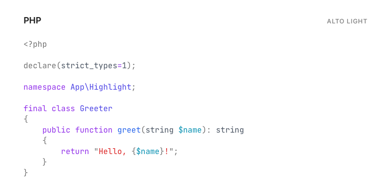 |

| GitHub Dark | GitHub Light |
|---|---|
| 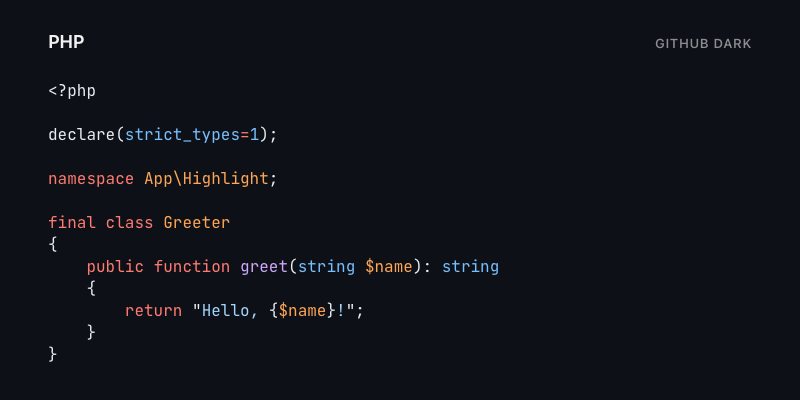 | 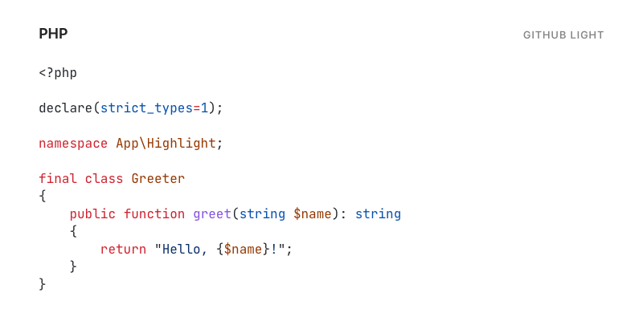 |

### Twig

| Alto Dark | Alto Light |
|---|---|
| 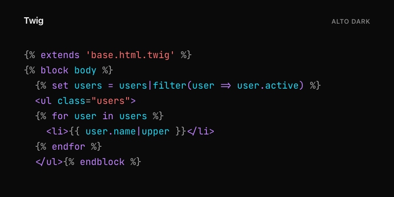 | 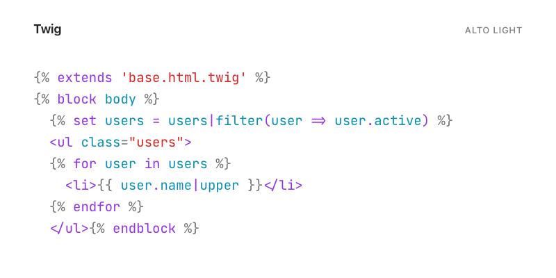 |

| GitHub Dark | GitHub Light |
|---|---|
| 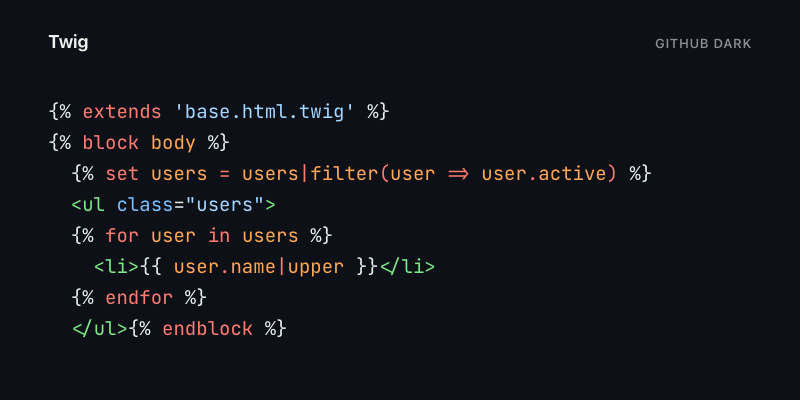 | 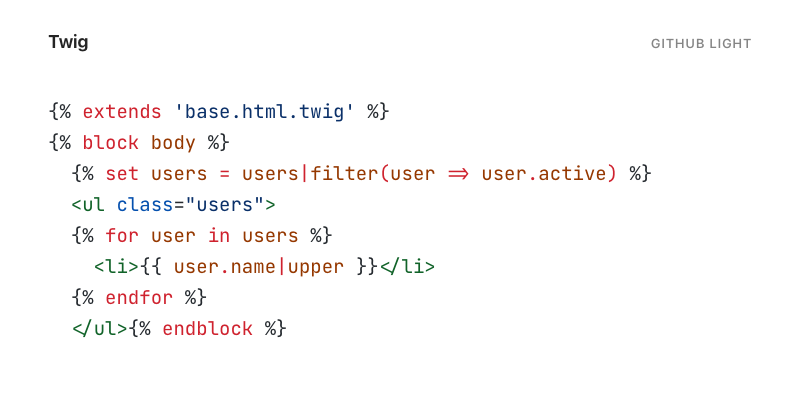 |

### HTML

| Alto Dark | Alto Light |
|---|---|
| 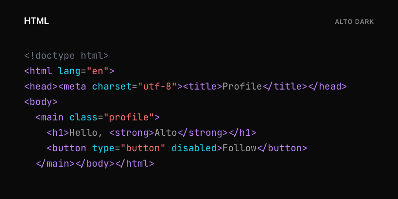 | 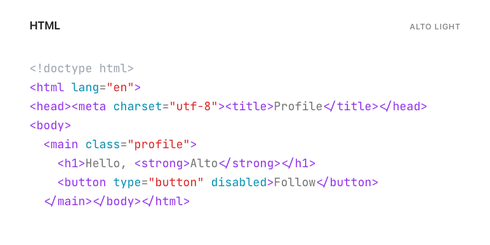 |

| GitHub Dark | GitHub Light |
|---|---|
| 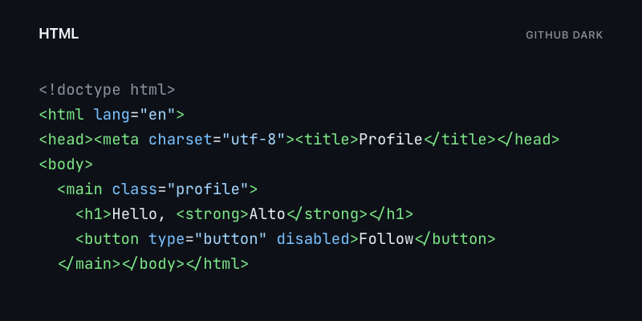 | 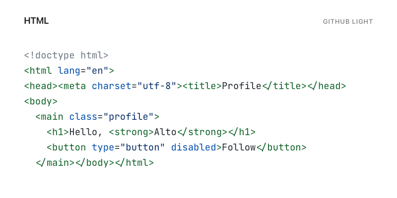 |

### JavaScript

| Alto Dark | Alto Light |
|---|---|
| 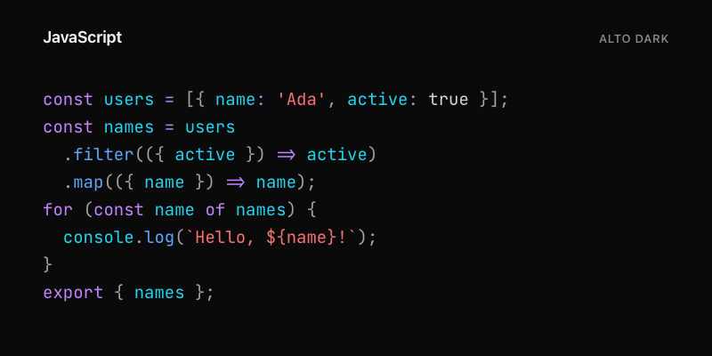 | 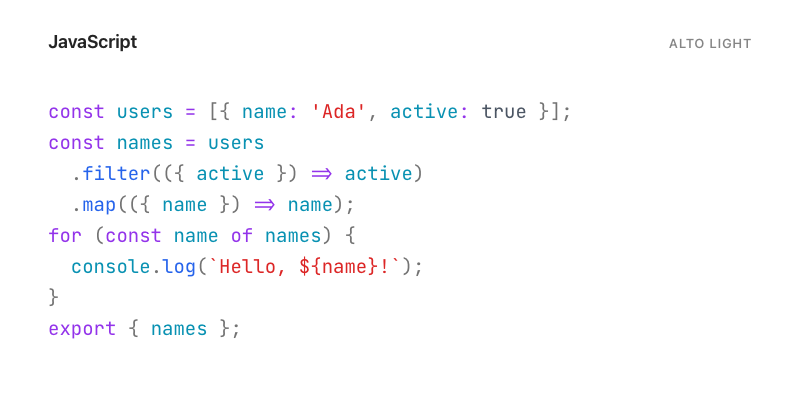 |

| GitHub Dark | GitHub Light |
|---|---|
| 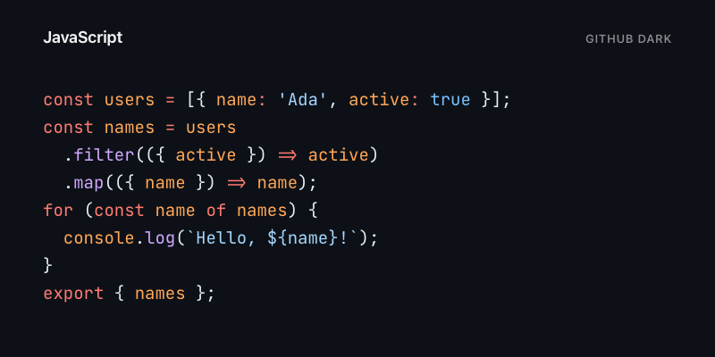 | 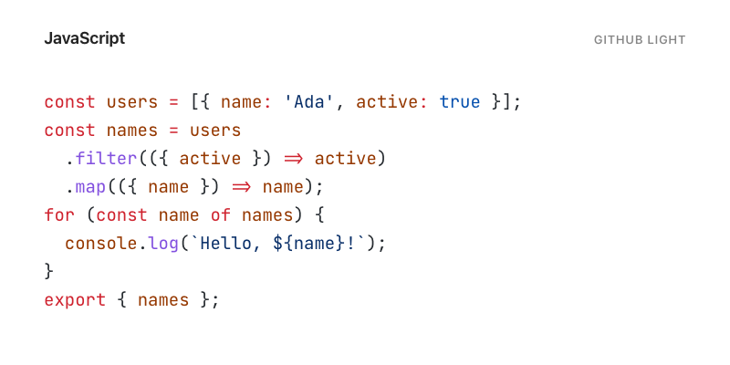 |

### CSS

| Alto Dark | Alto Light |
|---|---|
| 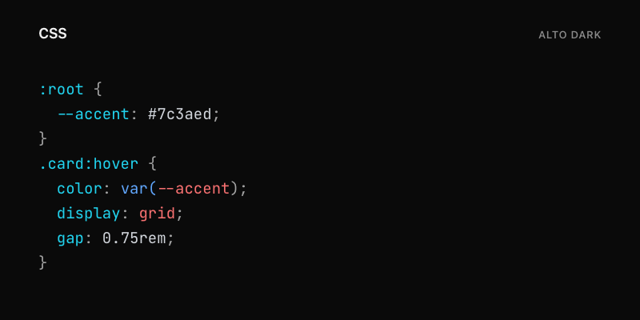 | 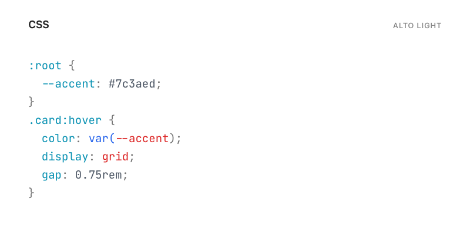 |

| GitHub Dark | GitHub Light |
|---|---|
| 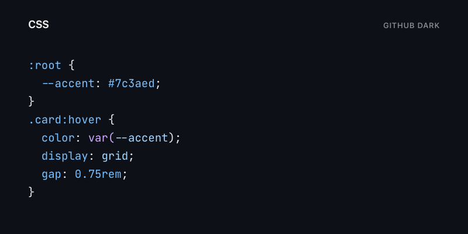 | 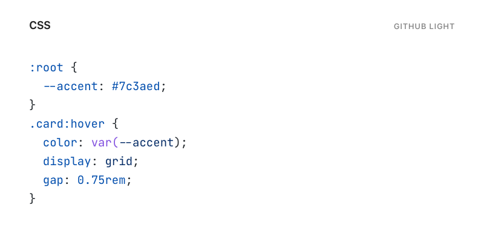 |

## Generate previews locally

The isolated showcase tool can render a specific language/theme pair, one
language across themes, one theme across languages, or its default featured
matrix:

```bash
cd tools/docs-showcase
composer install
npm install
npx playwright install chromium

npm run refresh
npm run generate -- --language=php
npm run generate -- --theme=alto-dark
npm run generate -- --language=php --theme=github-light
npm run capture -- --language=php --theme=github-light
```

`refresh` generates, captures, and verifies the featured matrix. Use `--all`
with the `generate`, `capture`, and `verify` commands for the complete
language/theme matrix. Generated intermediate HTML stays under
`tools/docs-showcase/build/`; published images are written under
`docs/assets/examples/`.

The generator accepts every registered language and every built-in theme
variant. Its default publication set is the five languages shown above across
Alto Dark, Alto Light, GitHub Dark, and GitHub Light.

## Example contract

Every canonical source file:

- stays within an 8-13 visible-line budget;
- uses the language's exact public identifier in the catalog;
- contains representative, deterministic source;
- reconstructs exactly after highlighting;
- fits in the fixed-size preview without wrapping or clipping.

The catalog and verification tools reject missing, duplicate, or unknown
language entries. See [Creating a theme](creating-a-theme.md) to use these
samples when reviewing a custom theme.
